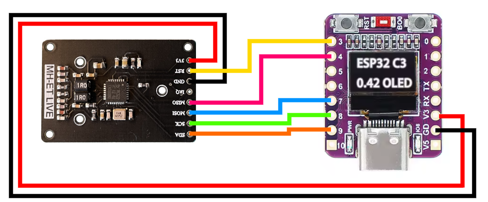

# Snapmaker U1 Remote RFID Reader

This repository contains the source code for a small RFID device designed to read RFID tags and send their contents to a Snapmaker U1 3D printer, so it acts as remote RFID antennas. On the printer side there is needed new GCODE to support remote RFID requests -> [TODO: put link here](https://github.com/paxx12/SnapmakerU1-Extended-Firmware)

## Features

- **RFID Tag Reading**: Reads data from RFID tags.
- **Printer Communication**: Sends the tag data to the Snapmaker U1 3D printer.
- **User Interface**: Provides a simple display and state management for user interaction.

## Hardware Requirements

- **ESP32 Device**: The code is designed to run on an ESP32 microcontroller. Additional boards support will be added in the future. 
- **RC522 RFID Module**: Currently supports the RC522 module for RFID tag reading. Additional module support will be added in the future.
- **Tested Hardware**: The project has been tested on the ESP32-C3-OLED board with the RC522 mini module.

# Connection diagram
Warning pins 5 and 6 are used by oled display



## Software Requirements

- **MicroPython**: The ESP32 device must be flashed with MicroPython firmware. You can download the firmware from the [official MicroPython website](https://micropython.org/).
- **SSD1306**: MicroPython SSD1306 OLED driver for I2C and SPI [source](https://github.com/CytronTechnologies/MAKER-PI-PICO/blob/main/Example%20Code/MicroPython/I2C%20OLED/ssd1306.py)
- **MFRC522** MicroPython RC522 driver for SPI [source](https://github.com/wendlers/micropython-mfrc522/blob/master/mfrc522.py)
  - modify line 32 to `elif board == 'esp8266' or board == 'esp32':`

## Setup

1. **Flash MicroPython to ESP32**:
   - Download the MicroPython firmware for your ESP32 device.
   - Use choosen flashing tool, ex. [esptool-js](https://espressif.github.io/esptool-js/)
      - Flash Address: 0x0

2. **Enable networking and webrepl**:
   - Use a serial tool
      - PuTTY (connection type: Serial, Serial line: COM6, Speed: 115200)
      - picocom (`picocom -b115200 /dev/ttyACM0`)
   - Enable networking
   ```py
   import network
   wlan = network.WLAN(network.STA_IF)
   wlan.active(True)
   wlan.connect('NETWORK NAME', 'password')
   wlan.ifconfig('addr4')
   ```
   - You should get IP of ESP32
   - Enable webrepl `import webrepl_setup`
   - Perform reset (Ctrl-D)

3. **Upload code**
   - Open in browser url `http://[IP of EPS32]:8266/`
   - Use `Send a file` form to upload each file
     - make sure there is proper IP of Snampmaker U1 set in config.json

3. **Connect Hardware**:
   - Connect the RC522 module to the ESP32 device according to the pinout configuration in the code.

4. **Run the Code**:
   - Reboot or power up the ESP32

## Interface
   short press switches the state IDLE <> READ
   long press allows to do following actions
   - in IDLE, changes channel of filament to sent rfid data
   - in READ, sends data to printer after successfull read of rfid tag

## Future Plans

- Add support for additional RFID modules.
- Add media (device, connection diagram, showcase video)
- Add stl for cases
- Enhance compatibility with other ESP32 variants.
- Improve user interface features.
